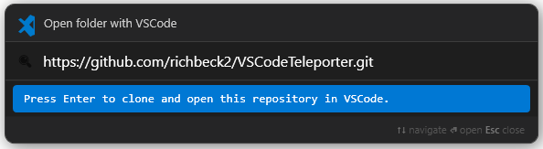

# VSCodeTeleporter

VSCodeTeleporter is a productivity utility designed to eliminate the friction of window management. With a single keyboard shortcut, you can instantly launch or "teleport" to a specific VSCode project, no more digging through directories or hunting through open windows.

* Launch new VSCode in your Source directory
* Jump to VSCode instance (if already open)
* Git Clone target URL (opens if target folder already exists)



## Getting Started

The [Pipeline/Action artifacts](https://github.com/richbeck2/VSCodeTeleporter/actions/workflows/dotnet.yml) contains a framework dependent release (assuming .NET 10 is installed) or a self-contained release.

Update the `appsettings.json` to suit your needs:

```json
{
  "SearchRoot": "C:\\src\\",
  "HotkeyModifiers": "Ctrl+Alt",
  "HotkeyKey": "S",
  "StartWithWindows": false
}
```

Run the executable `VSCodeTeleporter.exe`

### Configuration 

**SearchRoot**: The parent directory, containing all your source code.

**HotkeyModifiers**: The modifiers to trigger the tool, see [Modifier Key Names](https://learn.microsoft.com/en-us/windows/configuration/keyboard-filter/keyboardfilter-key-names#modifier-keys)

**HotkeyKey**: The hotkey to trigger the tool.

**StartWithWindows**: False by default, this can also be set from the taskbar, right-click the `>` icon.


## Troubleshooting

### Application won't start:

Windows may have blocked the files. Try `Unblock-File` through PowerShell, or right-click properties - unblock file.

### I run the application but don't see anything.

After running the executable, check for an `>` icon on the taskbar (by the clock). Double click the icon to launch, or use the keyboard shortcut.